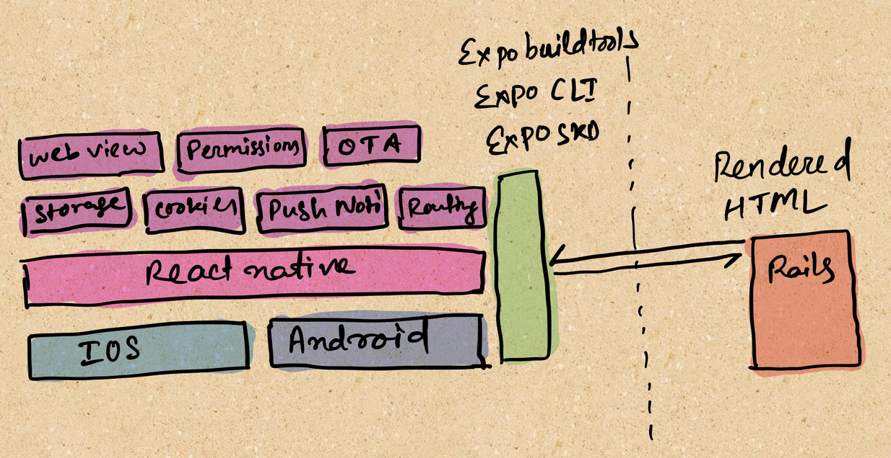

---
# Feel free to add content and custom Front Matter to this file.
# To modify the layout, see https://jekyllrb.com/docs/themes/#overriding-theme-defaults

layout: default
---

Have a web app already. Build an iOS and Android mobile app within a week with your existing web app. Supercharge the mobile app with push notifications, camera, and file access and other native features.

## Check if webtonative.app is for you?

* You are building an information production.
* You already have a beautiful mobile web and don't want to write the code for the native mobile app again.
* Know Javascript or willing to learn Javascript.
* Want to notify your mobile users via push notification.
* Figuring out the details of building the mobile apps is too daunting and don't have the bandwidth for it.
* You want to use some of the mobile hardware sensors and can't do that with a web app.

## Stack

We desinged the stack keeping in mind that minimal setup required on the native mobile side i.e. the app infrastructure. And all your business logic stays in the serverside, i.e. server rendered htmls.

Central components of this architecture are Expo, Webviews and Server Rendered Html.

### Architecture

### Components

1. React Native :

   Whenever you are building for mobile , its a no brainer to consider both IOS and Android. Now do you want to develop those two separately?? Having to develop separate apps for IOS and Android is quite steep and often daunting endeavor. Here is where React Native is a better fit than most. 
      * Cross-Platform - Maintain two platforms but share common technology i.e. JavaScript.
      * Write in Javascript but get to use native platform APIs
      * Better User interfaces and experience
      * Use in exitsing IOS and Android project or start from scratch

2. Expo

   Imagine no Xcode or Android Studio developement , only know writing code in javascript- that's Expo in frame.
   Open-source platform for making universal native apps for Android, iOS, and the web with JavaScript and React. Yeah, its one project that runs natively on all your users' devices. 
   Expo takes care of the infrastructure for starting an iOS and Android app to distributing to App store and Play store. Does most of the the heavy lifting hence helping you accelerate your development processes. 
   Few of the many exciting, developer centric and useful features that made us consider and use Expo for production apps were:

      * Maintain just one codebase and push to both platforms. 
      * Local developement made easy - We were able to develop , test and publish so fast without even figuring out the intricacies which Expo handles. Share a QR code or tunnel URL to your local with anyone to quickly checkout the app within mins of getting started. Fast refresh, true native capabilities, Push Notifications, are few of many such cool capabilities.
      * It has its own Expo CLI for running from a CLI/terminal.
      * Expo Client is a mobile app by Expo for quickly testing out your app during development process, once you publish it to expo servers.
      * Build for IOS and Android happens with few simple commands and you get the apk/aab and IPA to uplod to respective stores.
      * More importantly maintaining and ensuring the verification of certificates , provisioning profiles and other keys is a breeze through the CLI.

3. [React Navigation](https://reactnavigation.org)
4. [React Native Webview](https://github.com/react-native-webview/react-native-webview)
5. [Rails](https://rubyonrails.org)

## Showcase

1. Yoletters
   1. [Android](https://play.google.com/store/apps/details?id=com.yoletters.app)
   2. [iOS](https://apps.apple.com/in/app/yoletters/id1541643732#?platform=iphone)